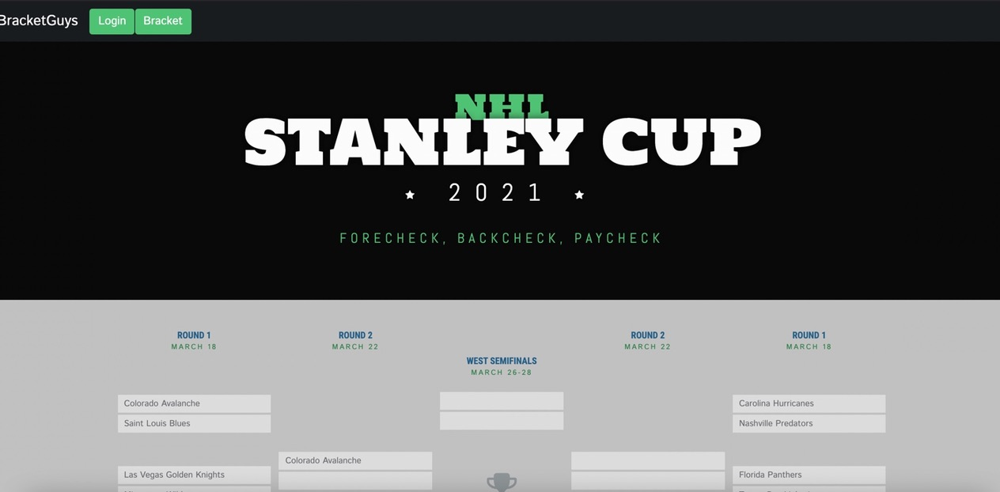
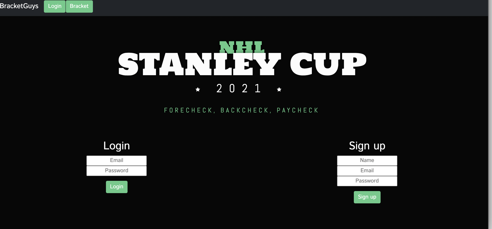

# Project 2
Interactive Full Stack Application

## License

This application is covered by the MIT license. 

# Description
As sports fans, we wanted to create a website the allows users to create a NHL playoff bracket.  Users can login, then make one or multiple brackets, delete a bracket and track their favorite hockey team through to the Stanley Cup Championship- Go Avalanche!!!
A MVC model was coded using Sequelize, Express, Javascript, CSS, MySQL database, Handlebars and deployed through Heroku.

# Usage
By using a simple UI/UX design the website allows users to easily navigate and create a bracket. 

# Creators
Chris Garcia- https://github.com/childishmartino
Evan Mora- https://github.com/Desalubrious
Jared Neisen- https://github.com/Jared-N2
Shawn Paulsen- https://github.com/spaulsen-creator
# Tests
No TDD tests or jest were used for this project.

# Questions
* Feel free to reach out to me with any additional questions.

## Code:
https://github.com/childishmartino/NHL-Playoff-Bracket

## Deployed app:

https://vast-falls-89463.herokuapp.com/